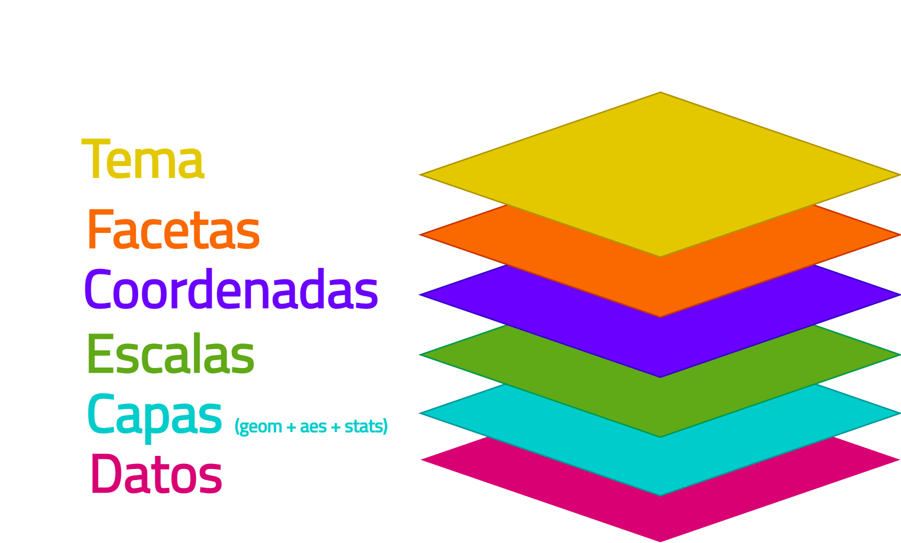

```{r setup, include=FALSE}
options(htmltools.dir.version = FALSE)
```

```{r xaringan-themer, include=FALSE, warning=FALSE}
library(xaringanthemer)
style_duo_accent(
  primary_color = "#39AEA9",
  secondary_color = "#E8FFC2",
  inverse_header_color = "A5BECC",
  text_font_google = google_font("Titillium Web", "400"),
  title_slide_background_color = "#d65ea6",
  header_font_google = google_font("Josefin Sans", "400", "400i", "600i", "700")
  
)
```

class: inverse
background-image: url("img/cohete.png")
background-size: 400px 400px
background-position: center right 50px

# Temario

--

**Repaso conceptos básicos ggplot**

--

**Cómo mejorar nuestro gráfico de forma sencilla**
  - Ejemplo práctico 1

--

**Cómo hacer énfasis en lo que queremos mostrar**
  - Ejemplo práctico 2

--

**Extensiones de ggplot**

--

**Tema y sus elementos**
  - Modificar el tema a nuestro gusto
      - Ejemplo práctico 3
--

**Uso creativo**
  - Ejemplo práctico 4


---
class: middle, inverse


# Antes de empezar, hablemos acerca de cómo nos vamos a organizar

---
class: middle

# La carpeta con el proyecto

### versión para descargar: AGREGAR AL FINAL!!
### copia en RStudio Cloud: https://bit.ly/ggplot22-cloud

---
class: middle

# Esta presentación

### https://bit.ly/ggplot22-presentacion


---
class: middle, inverse
# Conceptos básicos

---
# Lógica de capas

```{r, echo=F, out.width="90%", fig.align='center'}

```

---
# aestethics **`aes()`**

- La función `aes()` puede utilizarse en tres contextos:

```{r, eval = F}
## Por separado ##
# las estéticas dentro de aes() serán comunes a 
# todos los geom que utilice.
ggplot(datos)+
  `aes()` + 
  geom_col()

## Dentro de la función ggplot() ##
# las estéticas dentro de aes() serán comunes a
#  todos los geom que utilice.
ggplot(datos, `aes()`)+
  geom_col()

## Dentro de geom ##
# las estéticas dentro de aes() serán válidas 
# solo para el geom que la contiene.

ggplot(datos)+
  geom_col(`aes()`)

```

---
# aestethics **`aes()`**

- Ponemos dentro de esta función estéticas que queremos mostrar que **varían según los valores que toman nuestros datos**

- Las estéticas que podemos usar dependen del tipo de gráfico (`geom`) que estamos utilizando, pero las más utilizadas son:

  - x
  - y
  - color
  - fill
  - alpha
  - shape
  - size

---
# aestethics **`aes()`**

- Fuera de `aes()` podemos fijar aspectos estéticos que son comunes dentro de `geom` (no varían según los valores de los datos). Por ejemplo, si quiero que todas las columnas tengan una transparencia de 70%:

```{r, eval = F}
ggplot(datos, aes(x = ..., y = ..., fill = ...))+
  geom_col(`alpha = 0.7`)
```

- Podemos combinar estéticas dentro y fuera de `aes()`, y dentro y fuera de `geom_*()` para hacer el gráfico que tenemos en mente.

- Todas las estéticas que utilizamos pueden escalarse mediante las funciones `scale_*_*()`.

---
# scales

- Es muy importante entender si los valores que asignamos a una estética son de tipo continuo o discreto. Si asignamos mal la escala, recibiremos el famoso error:


```{css, echo=F}
.code-bg-red .remark-code, .code-bg-red .remark-code * {
 color:red!important;
}

.code-sm .remark-code, .codesm .remark-code * {
 font-size: 0.6em;
}
```

```{r, echo=T, warning=F, out.width="0%", eval = F}
library(ggplot2)
ggplot(iris, aes(x= Sepal.Length, y = Petal.Length, color = Species))+
  geom_point()+
  scale_color_`continuous`()
```

.code-bg-red[
```{r, error=TRUE, echo=F, warning=F, out.width="0%"}
library(ggplot2)
ggplot(iris, aes(x= Sepal.Length, y = Petal.Length, color = Species))+
  geom_point()+
  scale_color_continuous()
```
]

---
# scales

- También es un error común utilizar una función que no corresponde con la estética que queremos cambiar:

.pull-left[
```{r, eval = F}
library(ggplot2)
ggplot(iris, 
       aes(x = Sepal.Length, 
           y = Petal.Length, 
           `color` = Species)) +
  geom_point() +
  scale_`fill`_discrete(type = c("pink", 
                               "gold3", 
                               "cyan"))
```

En este caso **no** recibimos un error, pero tampoco visualizamos el cambio en la escala.

]

.pull-right[
```{r, echo = F, fig.align='center', out.width="70%"}
library(ggplot2)
ggplot(iris, 
       aes(x = Sepal.Length, 
           y = Petal.Length, 
           color = Species)) +
  geom_point() +
  scale_fill_discrete(type = c("pink", 
                               "gold3", 
                               "cyan"))
```
]

---
class: inverse, middle

# Cómo mejorar nuestro gráfico de forma sencilla `r emo::ji(keyword = "computer")`

**ejemplo práctico 1: : `codigo/01_mejoras-sencillas.R`**

---

class: inverse

---
class: inverse

# Resumen

- Revisar títulos y etiquetas
  - Cuáles son redundantes
  - Cuáles son necesarias

- Revisar etiquetas sobrepuestas
  - Invertir ejes
  - Escalar etiquetas con guides

- Utilizar colores que tengan relación con los datos

- Revisar leyenda

- Guardar, buen tamaño, buena resolución

---
class: middle

# Volvemos en
`r countdown::countdown(minutes = 5, seconds = 00, top = "38%", right = "39%")`
---
class: inverse, middle

# Cómo hacer énfasis en lo que queremos mostrar `r emo::ji(keyword = "computer")`

**ejemplo práctico 2: `codigo/02_enfocar-la-atencion.R`**

---
class: inverse


---
class: inverse

# Resumen

- Ayuda a quien lee a enfocarse en los datos de interés
- Incluye anotaciones que ayuden a interpretar los datos, sobre todo en los casos en que no hay un texto que acompaña al gráfico
- Procura que las etiquetas de los ejes y el formato de los valores sean entendibles

---
class: inverse, middle

# Extensiones de ggplot `r emo::ji(keyword = "earth_americas")`

**Un universo de paquetes**

---
# Para publicaciones

- [{ggstatsplot}](https://indrajeetpatil.github.io/ggstatsplot/) 

- [{ggpubr}](https://rpkgs.datanovia.com/ggpubr/)

---
# Unir gráficos

- [{patchwork}](https://patchwork.data-imaginist.com/)

- [{cowplot}](https://wilkelab.org/cowplot/index.html)

---
# Más geoms

- [{ggforce}](https://ggforce.data-imaginist.com/)

- [{ggraph}](https://ggraph.data-imaginist.com/)

- [{ggwordcloud}](https://lepennec.github.io/ggwordcloud/)

---
# Otros usos

- [{calendR}](https://r-coder.com/calendar-plot-r/)

- [{ggkeyboard}](https://github.com/sharlagelfand/ggkeyboard)

---
class: inverse, middle

# Tema `r emo::ji(keyword = "rocket")`

**Cómo hacer el gráfico que tengo en mente**

---
# Paquetes para temas

- [{ggthemes}](https://yutannihilation.github.io/allYourFigureAreBelongToUs/ggthemes/)
- [{hrbrthemes}](https://cinc.rud.is/web/packages/hrbrthemes/)
- [{ggdark}](https://github.com/nsgrantham/ggdark)
- [{tvthemes}](https://ryo-n7.github.io/2019-05-16-introducing-tvthemes-package/)

---
---
class: inverse, middle

# Cómo modificar el tema `r emo::ji(keyword = "computer")`

**ejemplo práctico 3: `codigo/03_modificar-el-tema.R`**
---
class: middle

# Volvemos en
`r countdown::countdown(minutes = 5, seconds = 00, top = "38%", right = "39%")`
---
---
class: inverse, middle

# Uso creativo `r emo::ji(keyword = "star")`

**Hay mucho más por aprender: codigo/04_uso-creativo.R**

---
class: inverse, middle

# Cómo practicar `r emo::ji(keyword = "muscle")`

**Desafíos de visualización**

---
class: inverse, middle
# ¡Muchas gracias! `r emo::ji(keyword = "clap")`

Material disponible en el [repositorio del taller](https://github.com/sporella/user2022_mas_sobre_ggplot)
