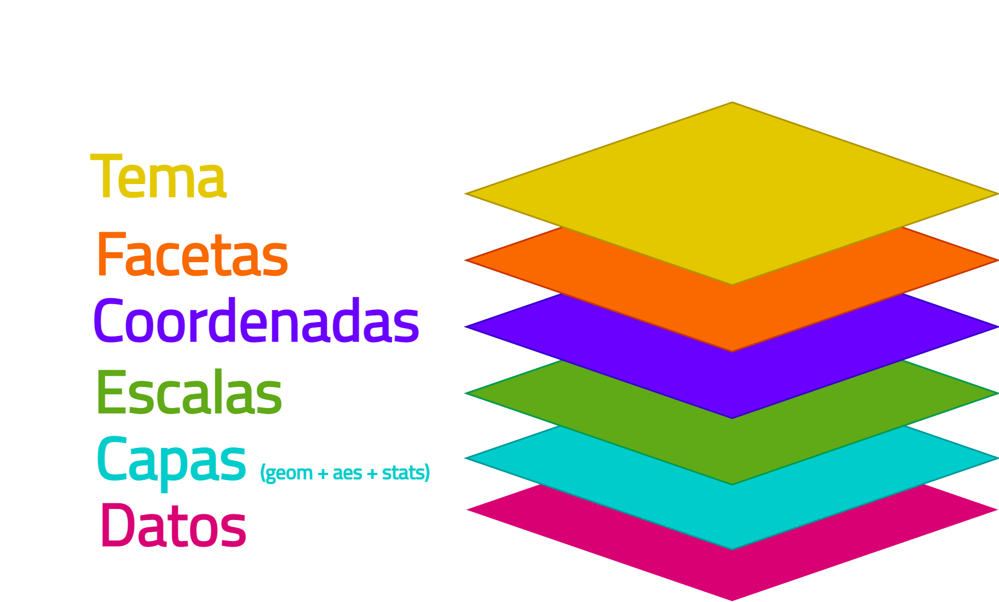

```{r setup, include=FALSE}
options(htmltools.dir.version = FALSE)
```

```{r xaringan-themer, include=FALSE, warning=FALSE}
library(xaringanthemer)
style_duo_accent(
  primary_color = "#39AEA9",
  secondary_color = "#E8FFC2",
  inverse_header_color = "A5BECC",
  text_font_google = google_font("Titillium Web", "400"),
  title_slide_background_color = "#d65ea6",
  header_font_google = google_font("Josefin Sans", "400", "400i", "600i", "700")
  
)
```

class: inverse
# Temario

--
- **Repaso conceptos básicos ggplot**

--
- **Cómo mejorar nuestro gráfico de forma sencilla**

--
  - Ejemplo práctico 1

--
- **Cómo hacer énfasis en lo que queremos mostrar**

--
  - Ejemplo práctico 2

--
- **Tema**

--
  - Modificar el tema mediante paquetes 
  - Modificar el tema a nuestro gusto
      - Elementos del tema
      - Actividad práctica

--
- **Extensiones de ggplot**

--
- **Más consejos**

--
- **Cierre**

---
class: middle, inverse
# Conceptos básicos

---
# Lógica de capas

```{r, echo=F, out.width="90%", fig.align='center'}

```

---
# Lógica de capas

```{r, eval = F}
ggplot(datos, 
       aes(x = ..., y = ..., fill = ..., color =...))+
  geom_*()+
  scale_*_**()+
  coord_*()+
  facet_*(...~...)+
  theme(...,
        ...,
        ...)
```

---
# Lógica de capas

```{r, eval = F}
ggplot(datos)+
  geom_*(aes(x = ..., y = ..., fill = ..., color =...))+
  scale_*_**()+
  coord_*()+
  facet_*(...~...)+
  theme(...,
        ...,
        ...)
```

---
# Lógica de capas

```{r, eval = F}
ggplot(datos, aes(x = ..., y = ..., fill = ..., color =...))+
  geom_*(color = "red")+
  scale_*_**()+
  coord_*()+
  facet_*(...~...)+
  theme(...,
        ...,
        ...)
```


---
# aestethics **`aes()`**

- La función `aes()` puede utilizarse en tres contextos:

```{r, eval = F}
## Por separado ##
# las estéticas dentro de aes() serán comunes a 
# todos los geom que utilice.
ggplot(datos)+
  aes()+
  geom_col()

## Dentro de la función `ggplot()` ##
# las estéticas dentro de aes() serán comunes a
#  todos los geom que utilice.
ggplot(datos, aes())+
  geom_col()

## Dentro de geom ##
# las estéticas dentro de aes() serán válidas 
# solo para el geom que la contiene.

ggplot(datos)+
  geom_col(aes())

```

---
# aestethics **`aes()`**

- Ponemos dentro de esta función estéticas que queremos mostrar que **varían según los valores que toman nuestros datos**

- Las estéticas que podemos usar dependen del tipo de gráfico (`geom`) que estamos utilizando, pero las más utilizadas son:

  - x
  - y
  - color
  - fill
  - alpha
  - shape
  - size

---
# aestethics **`aes()`**

- Fuera de `aes()` podemos fijar aspectos estéticos que son comunes dentro de `geom` (no varían según los valores de los datos). Por ejemplo, si quiero que todas las columnas tengan una transparencia de 70%:

```{r, eval = F}
ggplot(datos, aes(x = ..., y = ..., fill = ...))+
  geom_col(alpha = 0.7)
```

- Podemos combinar estéticas dentro y fuera de `aes()`, y dentro y fuera de `geom_*()` para hacer el gráfico que tenemos en mente.

- Todas las estéticas que utilizamos pueden escalarse mediante las funciones `scale_*_*()`.

---
# scales

- Es muy importante entender si los valores que asignamos a una estética son de tipo continuo o discreto. Si asignamos mal la escala, recibiremos el famoso error:


```{css, echo=F}
.code-bg-red .remark-code, .code-bg-red .remark-code * {
 color:red!important;
}

.code-sm .remark-code, .codesm .remark-code * {
 font-size: 0.6em;
}
```

.code-bg-red[
```{r, error=TRUE, echo=T, warning=F, out.width="0%"}
library(ggplot2)
ggplot(iris, aes(x= Sepal.Length, y = Petal.Length, color = Species))+
  geom_point()+
  scale_color_continuous()
```
]

---
# scales

- También es un error común utilizar una función que no corresponde con la estética que queremos cambiar:

.pull-left[
```{r, eval = F}
library(ggplot2)
ggplot(iris, 
       aes(x = Sepal.Length, 
           y = Petal.Length, 
           color = Species)) +
  geom_point() +
  scale_fill_discrete(type = c("pink", 
                               "gold3", 
                               "cyan"))
```

En este caso **no** recibimos un error, pero tampoco visualizamos el cambio en la escala.

]

.pull-right[
```{r, echo = F, fig.align='right'}
library(ggplot2)
ggplot(iris, 
       aes(x = Sepal.Length, 
           y = Petal.Length, 
           color = Species)) +
  geom_point() +
  scale_fill_discrete(type = c("pink", 
                               "gold3", 
                               "cyan"))
```
]

---
class: inverse, middle

# Cómo mejorar nuestro gráfico de forma sencilla `r emo::ji(keyword = "computer")`

**ejemplo práctico 1**

---
class: inverse

# Resumen

- Revisar títulos y etiquetas
  - Cuáles son redundantes
  - Cuáles son necesarias

- Revisar etiquetas sobrepuestas
  - Invertir ejes
  - Escalar etiquetas con guides

- Utilizar colores que tengan relación con los datos

- Revisar leyenda

---
class: inverse, middle

# Cómo hacer énfasis en lo que queremos mostrar `r emo::ji(keyword = "computer")`

**ejemplo práctico 2**

---
class: inverse

# Resumen

---
class: inverse, middle

# Tema `r emo::ji(keyword = "rocket")`

**Cómo hacer el gráfico que tengo en mente**

---
# Paquetes para temas

---
# Elementos del tema

---
class: inverse, middle

# Actividad práctica `r emo::ji(keyword = "muscle")`

**Apliquemos lo aprendido**

---
class: inverse, middle

# Extensiones de ggplot `r emo::ji(keyword = "world")`

**Un universo de paquetes**

---
class: inverse, middle

# Más consejos `r emo::ji(keyword = "star")`

**Hay mucho más por aprender**

